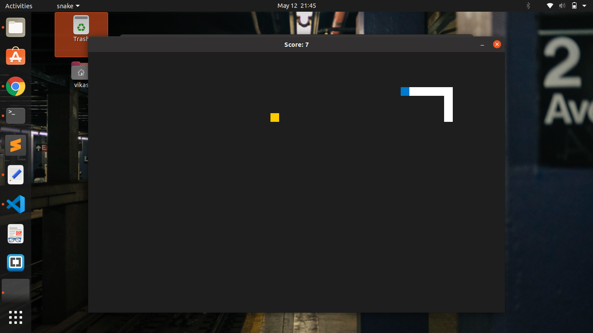

# Snake Game
Designing snake game using SDL(Simple DirectMedia Layer) and C++ language 

## Instruction(for Linux)
<pre>
git clone https://github.com/vikaschoudharycs097/SnakeGame
make  # command to install snake game
snake  # command to run snake game
</pre>

## License
See the [LICENSE](LICENSE) file for license rights and limitations (MIT).
